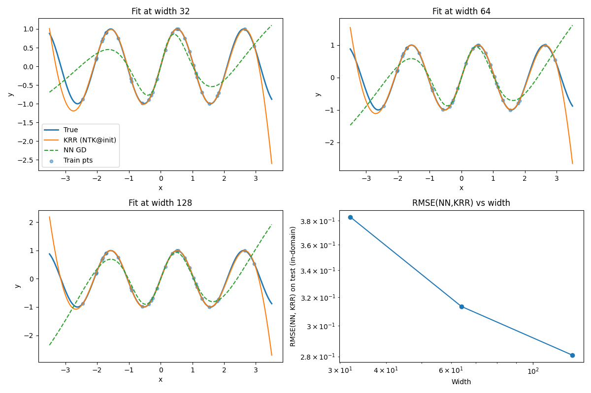

# nnRegimes
This is a non-rigorous experiment to show how gradient descent training of a wide neural network approaches kernel regresion governed by the Neural Tangent Kernel (NTK).

## Overview
At its core, we sample a 1D regression dataset from the target function sin(3x). For a list of chosen widths, we initialize a 2-layer MLP.
We then compute the empirical NTK at initialization and solve the kernel ridge regression problem.
Next, we train a neural network with gradient descent starting from the same initialization.
By calculating the root-mean-square between the predicted value generated by KRR and the NN, we can understand their agreement as a function of width.

## Theory
In the infinite-width limit, the network parameters stay close to their initialization during training.
Writing $W_t$ for the parameters at time $t$ and $W_0$ for initialization, we can perform a first-order Taylor expansion around $W_0$ on a sample set $X$:

$$
f(W_t, X) \approx f(W_0, X) + \left(\nabla_W f(W, X)\big|_{W=W_0}\right)^\top (W_t - W_0).
$$

Define the Jacobian at initialization

$$
\Phi(X) := \nabla_W f(W, X)\big|_{W=W_0}\in\mathbb{R}^{p\times n},
$$

where $p$ is the total number of network parameters and $n$ is the number of training examples. Writing

$$
\Phi(X) = \big[\phi(x_1),\phi(x_2),\cdots,\phi(x_n)\big],
$$

the column

$$
\phi(x_i) := \nabla_W f(x_i; W)\big|_{W=W_0} \in \mathbb{R}^p
$$

is the **sensitivity vector** at $x_i$ whose $k$-th entry measures how much the prediction at $x_i$ changes under an infinitesimal perturbation of parameter $W_k$.
In the NTK regime, these sensitivity vectors remain essentially constant during training (because $W_t$ stays close to $W_0$). 
Under gradient flow for squared loss, the prediction dynamics reduce to

$$
\frac{df_t}{dt} = -\Phi(X)^\top \Phi(X)(f_t - Y).
$$

The matrix

$$
\Theta(X, X) := \Phi(X)^\top \Phi(X)
$$

is the **Neural Tangent Kernel (NTK) matrix**. 
Its entry $\Theta_{ij}=\langle\phi(x_i),\phi(x_j)\rangle$ measures how strongly an update that reduces error at $x_i$ also changes the prediction at $x_j$.
In the lazy regime, the NTK matrix is effectively constant.

## Implementation
### “Effective” training time

To compare widths fairly, we scale:
- learning rate: `lr = BASE_LR / width`
- steps: chosen so `lr * steps ≈ TARGET_TIME`

This approximates matching the continuous-time training horizon across widths (useful when thinking in terms of gradient flow).

### Computing the empirical NTK features

**Goal:** compute $\phi(x)=\nabla_W f(x;W)|_{W=W_0}$ for each datapoint and stack into $J$.

- `jacrev(f_single)` computes the gradient of a scalar output w.r.t. the parameter PyTree (dict of tensors).
- `flatten_pytree` concatenates the per-parameter gradient tensors into a single length-\(p\) vector.
- `vmap(per_ex_grad)(X_train)` produces a matrix `J_train` of shape `[n, p]`.

Then:
- `K_train = J_train @ J_train.T` computes $K(X,X)\in\mathbb{R}^{n\times n}$
- `K_test_train = J_test @ J_train.T` computes $K(X_*,X)\in\mathbb{R}^{m\times n}$

### Making predictions
The linearized network around $W_0$ means linear regression in $\phi(x)$. 
Ridge regression in this linear model turns into a kernel system via the "dual" formulation, namely $(K+\lambda I)\alpha=y'$.
Solving for $\alpha$ in code:
- `alpha = solve_psd(K_train + ridge * I, y_train - f0_train)`

To predict on points, we use `alpha` like so:

$$
f(X)=f_0(X)+K(X,X)\alpha.
$$

## Results

